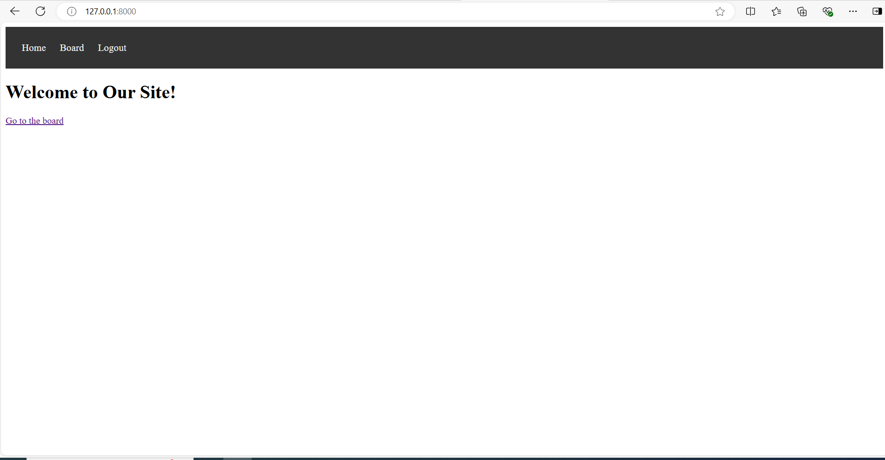

# Django Bulletin Board Project

Этот проект представляет собой простое приложение для объявлений (bulletin board), созданное с использованием Django. 
Пользователи могут регистрироваться, создавать, просматривать, редактировать и комментировать объявления.

## Оглавление

1. Описание проекта
2. Функциональность
3. Скриншоты
3. Установка
4. Запуск проекта
5. Использование
6. Технологии

## Описание проекта

Проект представляет собой веб-приложение, которое позволяет пользователям создавать, просматривать и редактировать 
объявления. Каждое объявление имеет заголовок, содержимое и автора. Пользователи могут оставлять комментарии к 
объявлениям.

## Функциональность

- **Регистрация и аутентификация:**
  - Пользователи могут регистрироваться и входить в систему.
  - После входа пользователи могут создавать, редактировать и удалять свои объявления.

- **Объявления:**
  - Создание, редактирование и просмотр объявлений.
  - Каждое объявление имеет заголовок, содержимое, автора и дату создания.

- **Комментарии:**
  - Пользователи могут оставлять комментарии к объявлениям.

- **Административная панель:**
  - Администраторы могут управлять объявлениями и комментариями через интерфейс Django Admin.

## Скриншоты
1. **Главная страница**



2. **Список объявлений**


4. **Детали объявлений**


5. **Форма регистрации**


5. **Форма редактирования объявлений**


6. **Форма удаления объявлений**


## Установка

Для установки и запуска проекта выполните следующие шаги:

1. **Клонируйте репозиторий:**

```dash
git clone https://github.com/your-username/bulletin-board.git
cd bulletin-board
```

2. **Создайте виртуальное окружение:**

```dash
python -m venv venv
source venv/bin/activate  # Для Linux/macOS
venv\Scripts\activate     # Для Windows
```

3. **Установите зависимости:**

```dash
pip install -r requirements.txt
```

4. **Примените миграции:**

```bash
python manage.py migrate
```

5. **Создайте суперпользователя (для доступа к административной панели):**

```dash
python manage.py createsuperuser
```

## Запуск проекта

1. **Запустите сервер разработки:**

```dash
python manage.py runserver
```

2. **Откройте приложение в браузере:**

Перейдите по адресу http://127.0.0.1:8000/.

## Использование
1. **Регистрация и вход:**
    - Перейдите на страницу http://127.0.0.1:8000/signup/ для регистрации нового пользователя.
    - Перейдите на страницу http://127.0.0.1:8000/login/ для входа в систему.
2. **Создание объявления:**
    - После входа перейдите на страницу http://127.0.0.1:8000/board/add/ для создания нового объявления.
3. **Просмотр объявлений:**
    - Перейдите на страницу http://127.0.0.1:8000/board/ для просмотра всех объявлений.
4. **Редактирование объявления:**
    - На странице деталей объявления (например, http://127.0.0.1:8000/board/advertisement/1/) нажмите на ссылку "Edit 
Advertisement", если вы являетесь автором объявления.
5. **Удаление объявления:**
    - На странице деталей объявления (например, http://127.0.0.1:8000/board/advertisement/1/) нажмите на ссылку "Delete
Advertisement", если вы являетесь автором объявления.
6. **Административная панель:**
    - Перейдите на страницу http://127.0.0.1:8000/admin/ для доступа к административной панели.

## Технологии
  - Django: Веб-фреймворк на Python.
  - SQLite: База данных по умолчанию.
  - HTML/CSS: Интерфейс пользователя.
  - Bootstrap (опционально): Для стилизации интерфейса.

## Автор
  Вереин Михаил Павлович 
  verein83@mail.ru
  